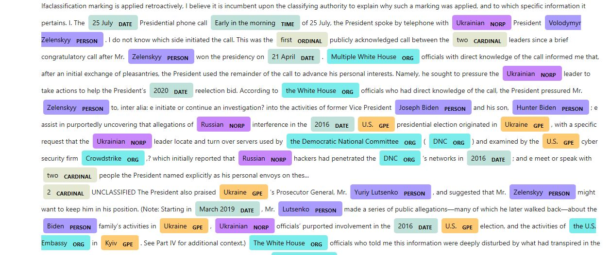

# PDF OCR and Named Entity Recognition - Whistleblower Complaint

In this short post we are going to retrieve all the entities in the "whistleblower complaint regarding President Trump's communications with Ukrainian President Volodymyr Zelensky" that was unclassified and made public today. I apply the techniques in my two previous blog posts, that is PDF OCR and named entity recognition. Instead of reading through the 16 pages to extract the names, dates, and organizations mentioned in the complaint, we will use natural language processing as a tool to automate this task .If any the techniques we are using is not familiar to you, refer to my  blog posts [Creating a Searchable Database with Text Extracted from Scanned Pdfs or Images](https://opokualbert.com/post.html#ocr) and [Named Entity Recognition With Spacy Python Package](https://opokualbert.com/post.html#spacy_ner).

The PDF we are using is published on [Washington Post](https://www.washingtonpost.com/context/read-the-whistleblower-complaint-regarding-president-trump-s-communications-with-ukrainian-president-volodymyr-zelensky/4b9e0ca5-3824-467f-b1a3-77f2d4ee16aa/). You can download and save to your directory but for this project, I decided to make every bit of the process automated. I used urllib python package to download the pdf. The entire code can be found on my [GitHub page](https://github.com/opokualbert/PDF-OCR-and-Named-Entity-Recognition).
